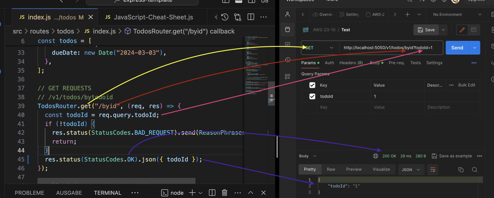
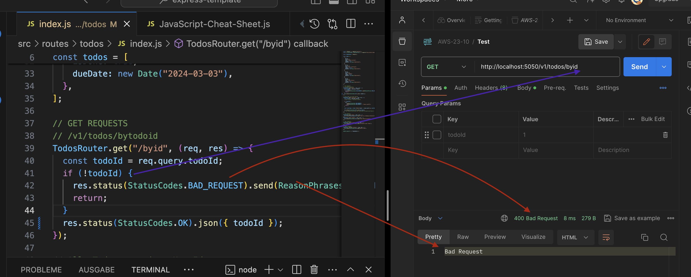
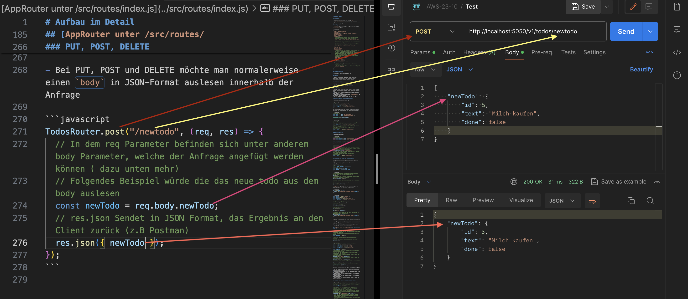

# Aufbau im Detail

## Grundlagen

- JavaScript Dateien haben die Endung `.js`
- `node <Dateiname>.js` führt JavaScript Datei aus
- npm ist für die Paketeverwaltung innerhhalb eines node.js Projekt zuständig

### package.json

- `npm init` Initalisiert Node.js Projekt und erstellt `package.json` Datei

```javascript
{
  "name": "express-template",
  "version": "1.0.0",
  "description": "1. `npm init` --> Um Projekt zu intitalisieren",
  "main": "index.js",
  "scripts": {
    // Skripte können von euch hinterlegt werden und über npm run <Skript-name> ausgeführt werden
    "test": "echo \"Error: no test specified\" && exit 1",
    // Das dev Skript in diesem Fall führt mit dem Paket nodemon die index.js Datei aus
    // nodemon dient als Hilfe bei der Entwicklung, um Dateiänderungen direkt auf die App anzuwenden ohne diese manuell neu starten zu müssen
    "dev": "nodemon -r dotenv/config index.js"
  },
  "author": "",
  "license": "ISC",
  "dependencies": {
    // Abhängigkeiten, die innerhalb eures Projekts mit npm install <Pkatename> installiert wurden
    // Sobald Paketnamen hinterlegt wurden, können diese Beim neuen aufsetzen des Proejekt über npm isntall aus dem Projektverzeichnis installiert werden
    // Die installierten Pakete landen in dem Ordner node_modules
    "body-parser": "^1.20.2",
    "cors": "^2.8.5",
    "dotenv": "^16.4.2",
    "express": "^4.18.2",
    "http-status-codes": "^2.3.0"
  },
  "devDependencies": {
    // Pakete, die über npm install -D <Paketename> installiert wurden
    // Nur für die Entwicklung (-D steht für development)
    "nodemon": "^3.0.3"
  }
}
```

### package-lock.json

- Listet alle installierten Pakete auf

## Imports

- Imports stehen immer ganz oben in der Datei und importieren Codeabschnitte von externen Paketen (node_moduels) oder weiteren loakeln Dateien

### Import vs require

- Das require wird in älteren Versionen von JavaScript verwendet
- Es gibt verschiedene JavaScript Module
- Ab dem Modul ES6 wurde import eingeführt

**Require**

```javascript
// Kennt ihr von eurer Express App
const { Router } = require("express");
```

**Imports**

```javascript
// Seit ES6 import Schreibweise eingeführt (Kennt iht aus React)
import { useState } from "react";
```

**Exports:**

- Es gibt einen export und einen default export, welche angeben, was von einer anderen Datei importiert werden kann
- Es kann viele exports aus einer Datei geben aber nur einen default export
- Beim importieren benutzen wir die `{<mein-import>}` um die exports zu importdieren
- Und für default exports lassen wir die `{}` weg

**Beispiel require: (Unsere Express App)**

- Kennen wir aus dieser NodeJS App

```javascript
// Imports
const express = require("express");
const cors = require("cors");
const bodyParser = require("body-parser");
const { AppRouter } = require("./src/routes");
```

Das Folgende Beispiel soll Profile in Objekten sammeln und diese für andere Dateien zum Import bereitstellen:

```javascript
// Profiles.js
const User1 = { name: "Max Mustermann" };
const User2 = { name: "Nina Weihnachtsmann" };

module.exports = { User1, User2 };
```

```javascript
// index.js
// Alles was sich in exports befindet wird als Objekt in AllProfiles hinterlegt
// Der Name AllProfiles ist von mir frei gewählt
const AllProfiles = require("./Profiles.js");
// Import von einem bestimmten Objekt durch {}, welches durch export definiert wurde
// Der Name muss mit dem Namen in Profile.js übereinstimmen
const { User1 } = require("./Profiles.js");
```

**Beispiel import:**

- Kennen wir aus React

```javascript
// Profiles.js
export const User1 = { name: "Max Mustermann" };
export const User2 = { name: "Nina Weihnachtsmann" };

const AllProfiles = { User1, User2 };

export default AllProfiles;
```

```javascript
// index.js
// Der default export kann wie folgt importiert werden
// Der Name AllProfiles ist von mir frei gewählt, sollte aber dem default export entsprechen
import AllProfiles from "./Profiles.js";
// Import von einem bestimmten Objekt durch {}, welches durch export definiert wurde
// Der Name muss mit dem Namen in Profile.js übereinstimmen
const { User1 } = require("./Profiles.js");
```

## Schauen wir im Detail auf unsere index.js

Über process.env können Umgebungsvariablen abgerufen werden.
Folgende Schreibeweise, dient dazu, mehrere Umgebungvariablen importieren zu können

```javascript
// Dies Schreibweise
const { PORT, DB_NAME } = process.env;
// Anstelle von
const PORT = process.env.PORT;
const DB_NAME = process.env.DB_NAME;
```

```javascript
// Mit app.use bindet ihr Komponenten/Middleware ein, die von eurer express App verwendet werde
app.use();
// Der Bodyparser ermöglicht es den body einer Anfrage auszulesen, dazu mehr im folgenden
app.use(bodyParser.json());

// bindet unseren Approuter (oben importiert) über die Route /v1 ein
// --> Bedeutet alles, was nach /v1 kommt soll auf den Aprouter gehen
app.use("/v1", AppRouter);
```

`app.listen`: Öffnet App auf dem angegebenen Port und hört auf alles, was auf diesem Port eingeht

```javascript
app.listen(PORT, () => {
  console.log(`Example app listening on port ${PORT}`);
});
```

```javascript
const express = require("express");
const cors = require("cors");
const bodyParser = require("body-parser");
const { AppRouter } = require("./src/routes");

// Zugriff auf Umgebungsvariablen
const { PORT } = process.env;

// Initialisierung von expres
const app = express();
app.use(bodyParser.json());

// Use for development
app.use(cors());

app.use("/v1", AppRouter);

// App hört im folgenden auf den Port, welcher über die Umgebungsvariable definiert ist
app.listen(PORT, () => {
  console.log(`Example app listening on port ${PORT}`);
});
```

Folgendes Ergebnis haben wir also, nach Aufruf der Datei:

- Die App hört auf alles, was auf unserem vordefinierten `PORT` eineght
- Alles, was sich unter `/v1` befindet soll auf unseren AppRouter verweisen
  --> Den Approuter haben wir aus einer anderen Datei importiert, schauen wir uns den mal an:

## [AppRouter unter /src/routes/index.js](../src/routes/index.js)

```javascript
// Mit einem Router kann man über einen Pfad auf weitere Komponenten verweisen
// Dazu muss man zunächst einen neuen Router wie folgt anlegen
const AppRouter = Router();

// mit .use kann man dann auf weitere Komponenten verweise,
// welche über einen Pfad eingebunden werden solle
AppRouter.use;
```

```javascript
// Das Paket Router wird von express importiert
const { Router } = require("express");
const { AuthRouter } = require("./auth");
const { UserRouter } = require("./user");
const { TodosRouter } = require("./todos");

const AppRouter = Router();
// Mit dem Pfad /auth wird unsere importiere Komponente Authrouter angesprochen
// Da wir auf den AppRouter mit /v1 verwiesen haben, sind wir also bei /v1/auth
// Bedeutet wenn /v1/auth Aufgerufen wird --> Nutze den import AuthRouter
AppRouter.use("/auth", AuthRouter);
// Bedeutet wenn /v1/user Aufgerufen wird --> Nutze den import UserRouter
AppRouter.use("/user", UserRouter);
// Bedeutet wenn /v1/todos Aufgerufen wird --> Nutze den import TodosRouter
AppRouter.use("/todos", TodosRouter);

// Export, damit der AppRouter importiert werden kann
module.exports = { AppRouter };
```

Folgendes Ergebnis haben wir also, nach Aufruf der Datei:

- Mit dem Pfad /auth wird unsere importiere Komponente Authrouter angesprochen
- Da wir auf den AppRouter mit /v1 verwiesen haben, sind wir also bei /v1/auth/
- Bedeutet wenn /v1/auth Aufgerufen wird --> Nutze den import AuthRouter
- Bedeutet wenn /v1/user Aufgerufen wird --> Nutze den import UserRouter
- Bedeutet wenn /v1/todos Aufgerufen wird --> Nutze den import TodosRouter

### Schauen wir jetzt in eine der Routen hinein

```javascript
// Wir definieren wieder einen neuen Router, um über eine bestimmte Route (z.B /byid) eine Aktion auszuführen
// Wir können get, put, post, delete Aktionen ausführen
const TodosRouter = Router();

// Der Aufbau ist wie folgt für alle HTTP Anfragen
// Erster input ist der Pfad, über den die Anfrage angesprochen werden soll (/<mein-Pfad>)
// Der zweite input ist eine Callback Funktion, welche die Anfrage über req mitgbibt und mit res eine Antwort zurücksenden kann
TodosRouter.get("/<mein-Pfad>", (req, res) => {
  // In dem req Parameter befinden sich unter anderem query Parameter, welche der Anfrage angefügt werden können ( dazu unten mehr)
  // Folgendes Beispiel würde die todoId von der Anfrage auslesen
  const todoId = req.query.todoId;
  // res.json Sendet in JSON Format, das Ergebnis an den Client zurück (z.B Postman)
  res.json({ todoId });
});

TodosRouter.get("/byid", (req, res) => {
  const todoId = req.query.todoId;
  if (!todoId) {
    res.status(StatusCodes.BAD_REQUEST).send(ReasonPhrases.BAD_REQUEST);
    return;
  }
  res.status(StatusCodes.OK).json({ todoId });
});
```

Folgendes haben wir also mit dem Aufruf dieses Abschnitts erreicht:

- Wenn eine GET Anfrage auf `/v1/todos/byid` eingeht lies die Query Parameter mit dem Key `todoId` aus
- Wenn der Parameter nicht vorhanden ist, gib eine Bad Request Antwort und ansonsten gib die todoId in JSON Format an den Client zurück

**Beispiel**
GET Ergebnis mit hinterlegter `todoId`


GET Ergebnis ohne hinterlegter `todoId`


### PUT, POST, DELETE

- Bei PUT, POST und DELETE möchte man normalerweise einen `body` in JSON-Format auslesen innerhalb der Anfrage

```javascript
TodosRouter.post("/newtodo", (req, res) => {
  // In dem req Parameter befinden sich unter anderem body Parameter, welche der Anfrage angefügt werden können ( dazu unten mehr)
  // Folgendes Beispiel würde die das neue todo aus dem body auslesen
  const newTodo = req.body.newTodo;
  // res.json Sendet in JSON Format, das Ergebnis an den Client zurück (z.B Postman)
  res.json({ newTodo });
});
```


